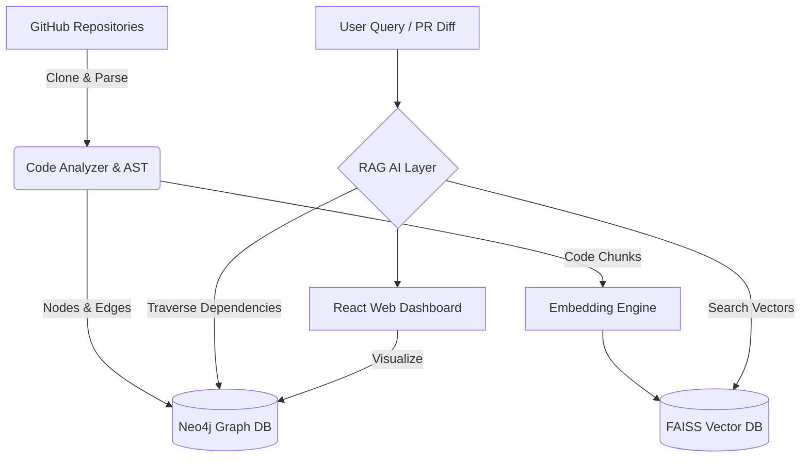

# AI Architecture Intelligence System

The AI Architecture Intelligence System automatically analyzes large software codebases, builds an architecture dependency graph, and predicts the blast radius of code changes.

It helps developers avoid "Architectural Amnesia" and reduce time spent on manual codebase archaeology by providing a Neo4j dependency graph, FAISS-backed Vector RAG search, and a beautiful React D3 Graph Dashboard.

## Features

- **Repository Ingestion**: Scans Python, JS/TS, and Java repositories using Git and Tree-sitter AST.
- **Static Code Analysis**: Extracts functions, classes, and their relationships.
- **Dependency Graph**: Stores the architecture graph in Neo4j.
- **Vector Search (RAG)**: Uses FAISS to index code chunks to answer architectural queries via an AI layer.
- **Blast Radius Analysis**: Predicts the downstream impact of PRs based on modified files and graph distance.
- **Visual Dashboard**: A React frontend featuring 2D force-directed architecture graphs and PR impact analysis.

## Architecture Diagram



## Setup and Deployment

### Requirements
- Docker and Docker Compose
- Node.js > 18 (for local frontend development)
- Python 3.11 (for local backend development)

### Quick Start (Docker)

1. **Clone the repository:**
   ```bash
   git clone https://github.com/nilpoten/ArchitectureAI/
   cd ArchitectureAI
   ```

2. **Start the Infrastructure (Neo4j, Postgres, Backend):**
   ```bash
   docker-compose up -d
   ```
   *Note: On first start, the backend API will be available at `http://localhost:8000`.*

3. **Start the Frontend Dashboard:**
   ```bash
   cd frontend
   npm install
   npm run dev
   ```
   *The dashboard will be available at `http://localhost:5173`.*

### Environment Variables

The backend uses a `.env` file for configuration (or environment variables). Key variables:
- `MOCK_LLM=true` (defaults to true for demo purposes, set to false to use OpenAI)
- `OPENAI_API_KEY=your_key`
- `NEO4J_URI=bolt://localhost:7687`

## Usage

1. Open the React Dashboard.
2. Enter a GitHub repository URL into the top search bar and click "Ingest".
3. Wait for the AST parser and Graph builder to index the repository.
4. The 2D Graph will render on the left, showing Modules, Classes, and Functions.
5. Ask architectural questions using the AI Query box.
6. Simulate a PR by entering file paths in the "Simulate PR Impact" panel to see the projected blast radius.
